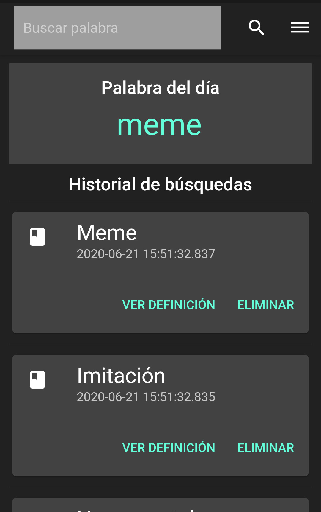
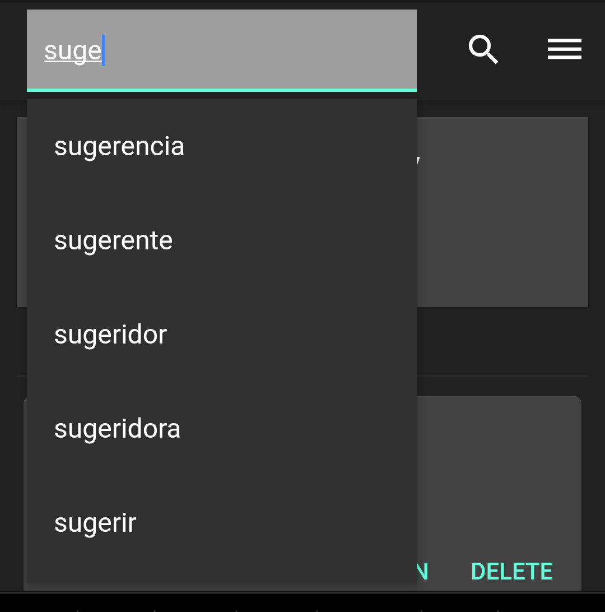
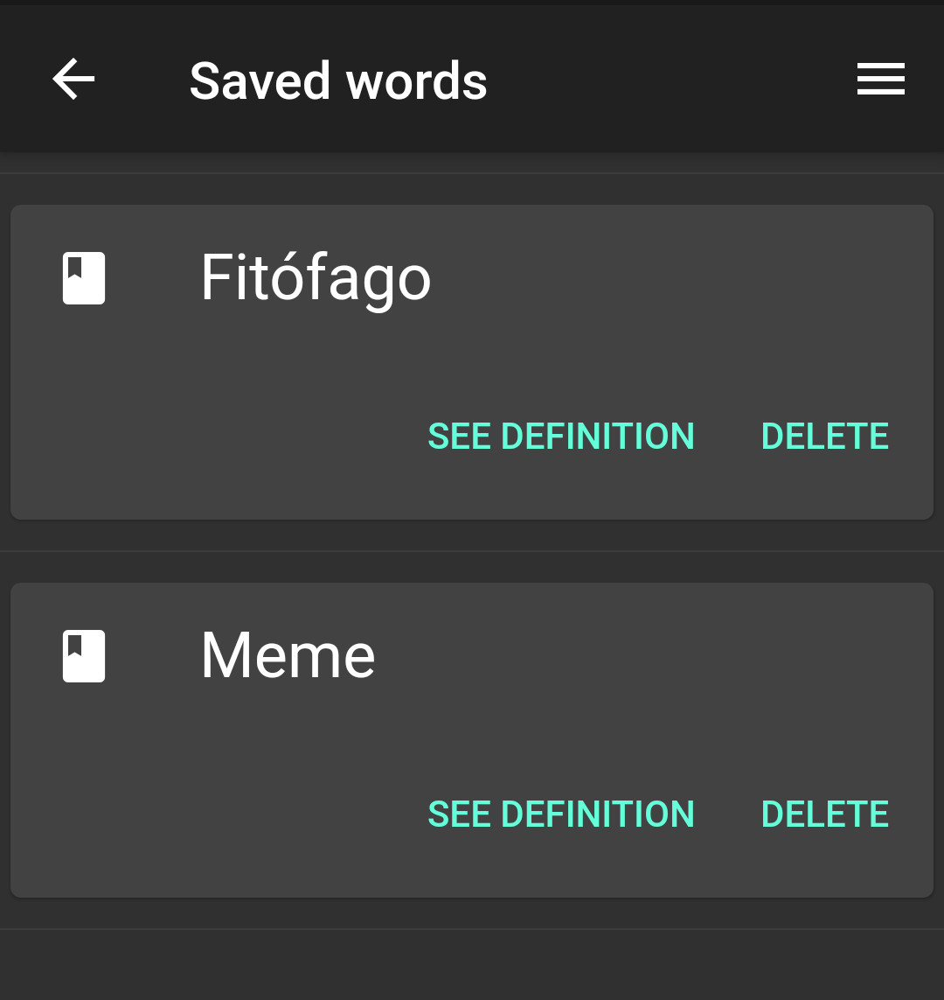
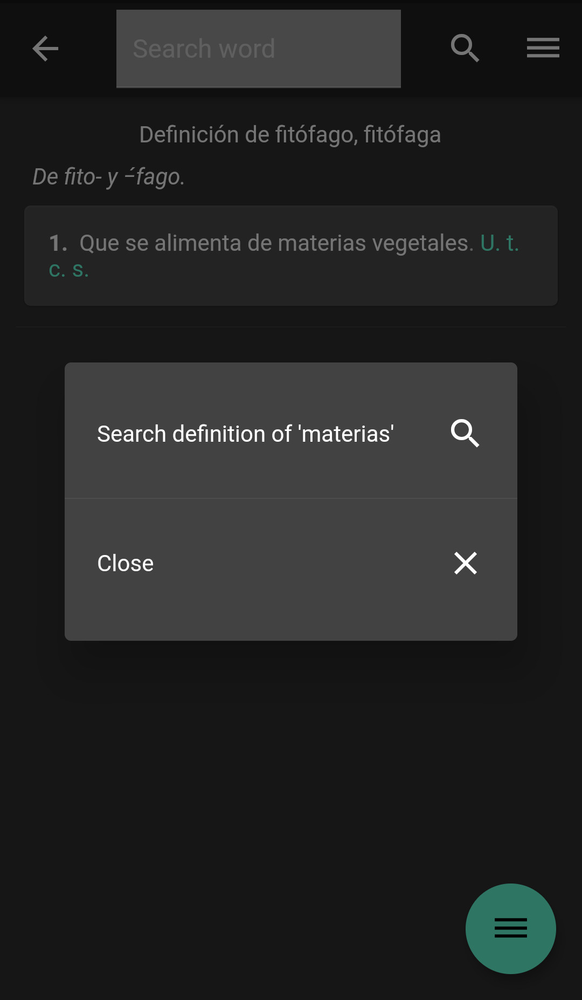
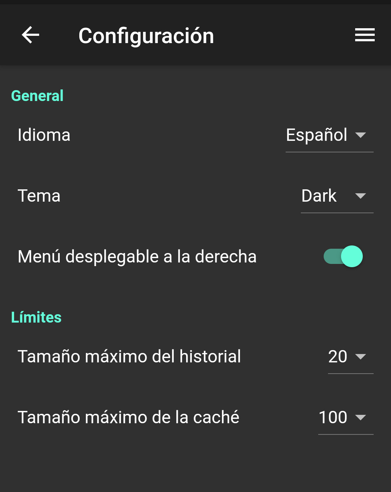

# Diccionario Alternativo de la RAE

Aunque ya existe [una aplicación oficial](https://play.google.com/store/apps/details?id=es.rae.dle&hl=es_419) para consultar el diccionario de la RAE, simplemente se muestra lo mismo que con el navegador y además está lleno de anuncios.

Por eso, decidí hacer mi propia aplicación que sacara los resultados de la página oficial (https://dle.rae.es), pero los presentara sin anuncios y de una manera más amigable para su uso con un móvil.

Toda la información se saca usando [este scraper](https://github.com/Foo-Manroot/rae_scraper) que hice precisamente para poder usarlo en una aplicación para móvil.

Principalmente, este proyecto lo he usado para aprender Flutter y Dart; así que habrá algunas cosas que estén programadas de una manera un tanto extraña, para poder explorar las capacidades de Flutter.


## La aplicación

Esta aplicación tiene tres pantallas principales: la pantalla principal, la de palabras guardadas y la vista de definición de una palabra.

### Pantalla inicial

Aquí se muestran el historial y la palabra del día:

<p align="center">
  
</p>

Si se pincha sobre la palabra del día, se realiza una petición para ver su definición.


Para buscar una palabra, se puede usar la barra superior.
A medida que se vaya escribiendo, se mostrarán las sugerencias de palabras recogidas en el diccionario que comiencen por lo que se haya escrito:

<p align="center">
  
</p>


### Palabras guardadas

En esta pantalla se muestran todas las palabras cuya definición se haya guardado en la BDD. Cuando se acceda a su definición (ya sea desde esta pantalla o desde la barra de búsqueda), no se creará ninguna petición a dle.rae.es, ahorrando tráfico de red.

<p align="center">
  
</p>


### Definición de una palabra

Una vez se ha accedido a la definición de una palabra, se puede pinchar en cualquier palabra que no esté en color gris oscuro para buscar su definición:

<p align="center">
  
</p>


### Configuración

En la pantalla de configuración se puede cambiar el tema (los colores de los temas oscuro y claro son los que vienen por defecto, porque soy terriblemente malo en la parte de diseño...), la cantidad de elementos que se deben guardar en el historial y algunas cosillas más:

<p align="center">
  
</p>


## Informar sobre un error

Si has visto algún fallo, puedes [crear un _issue_ en Github](https://github.com/Foo-Manroot/da_rae/issues) o enviarme un correo a [foomanroot@disroot.org](mailto:foomanroot@disroot.org)


Si quieres colaborar con el desarrollo, [cualquier aportación](https://github.com/Foo-Manroot/da_rae/pulls) es bienvenida :)


## Compilar

Debes tener instalado el SDK de [flutter](https://flutter.dev/docs/get-started/install) en tu ordenador.

Desde el directorio raíz, ejecuta
```sh
flutter run
```
si quieres ejecutar una versión de _debug_.


Si prefieres crear una versión para distribuir, ejecuta:
```sh
flutter build apk --shrink --release --split-per-abi
```
